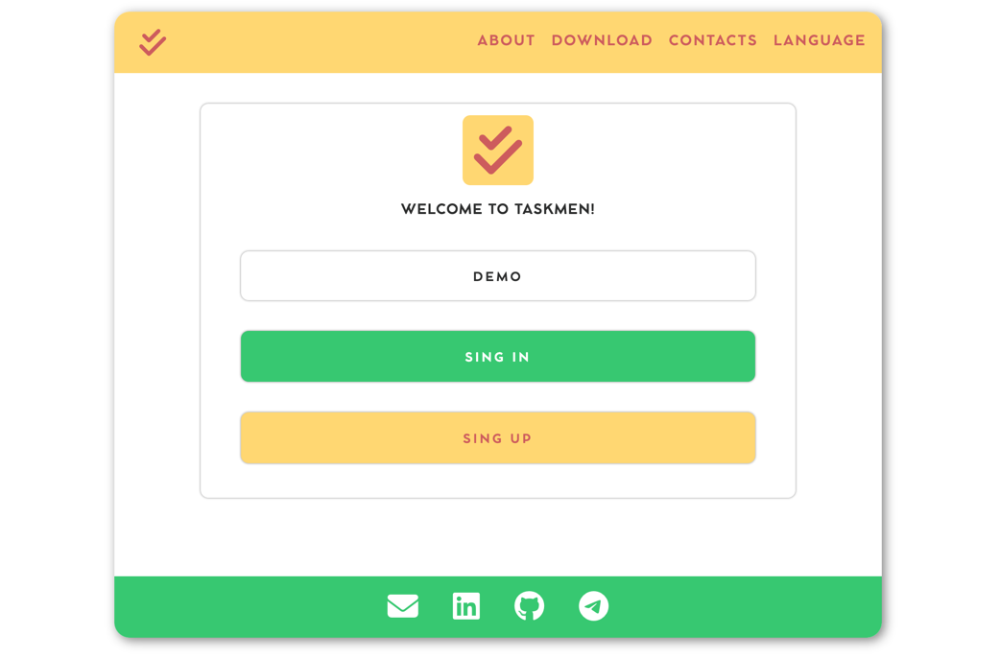
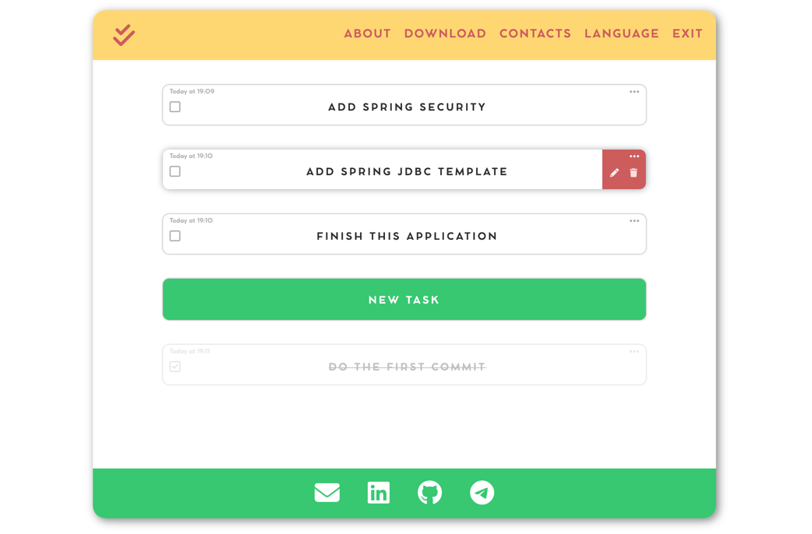
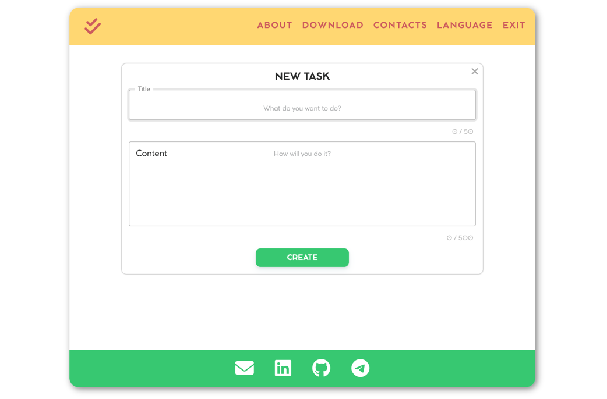
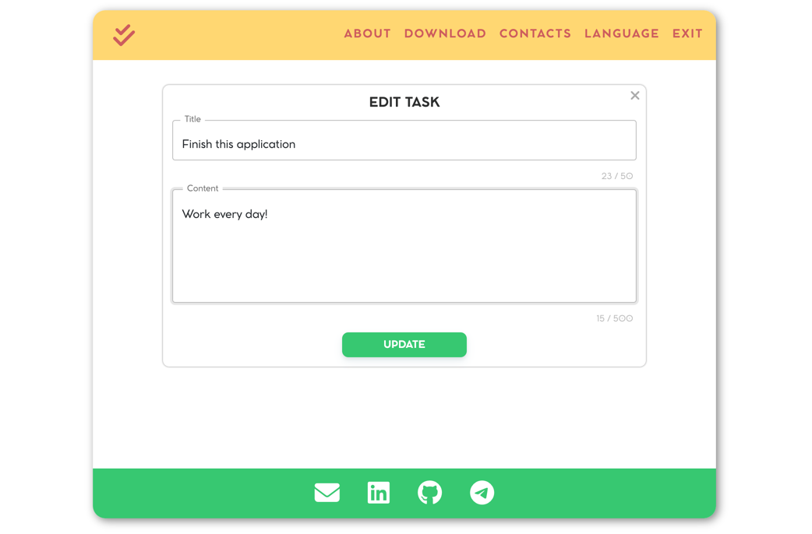

# TASKMEN

The loading of site can take about 30 seconds, because it is deployed on free cloud.

This project represent a Spring MVC application using a database.
---

The TASKMEN application is a task tracker.

On the main page users can sing up, sing in or use demo access:

After authentication user can see a list of his/her tasks:

User also can create a new task:

 

Or edit an existing one:

